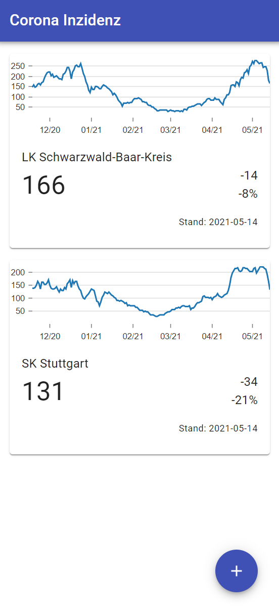

# Corona dashboard

This little app displays the latest seven day incidence rate for selected counties in Germany.
The data is taken from the Robert Koch Institut's homepage where the official data is updated daily.

Since the official data is only published as an Excel sheet, the data is downloaded and converted to
JSON by an AWS Lambda function and stored in S3. The web app downloads the JSON from S3.

The web app is deployed on [https://main.d3uiotj96wfvkg.amplifyapp.com/](https://main.d3uiotj96wfvkg.amplifyapp.com/).