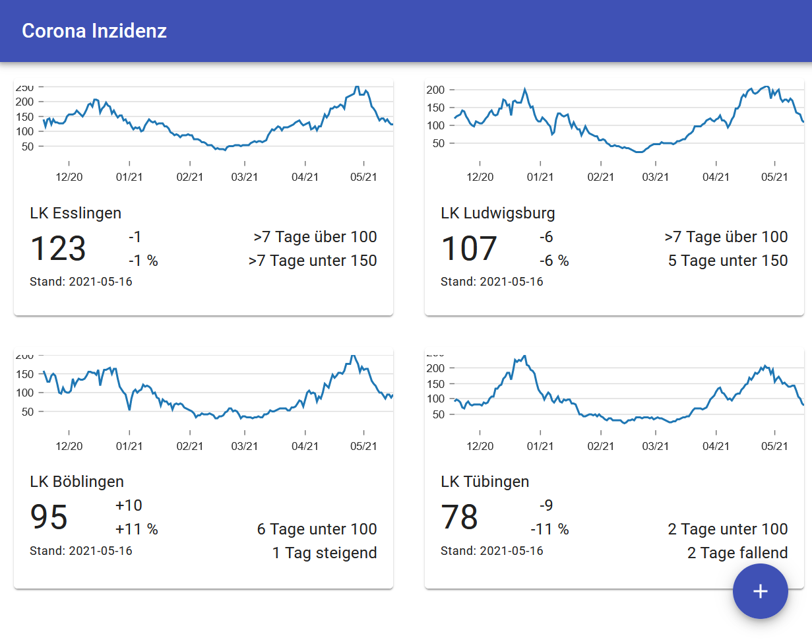

# Corona dashboard

This little app displays the latest seven day incidence rate for selected counties in Germany.
The data is taken from the Robert Koch Institut's homepage where the official data is updated daily.

Since the official data for the "Bundesnotbremse" is only published as an Excel sheet, 
the data is downloaded and converted to
JSON by an AWS Lambda function and stored in S3. The web app downloads the JSON from S3. For each county on the dashboard, it displays the latest incidence rate, the change since the day before in absolute numbers and in percent. 

If applicable, it will display the number of days the incidence rate has been below or above one of the thresholds of the "Bundesnotbremse". For counties with an incidence rate below 100, it will also show for how many days the rate has been rising or falling. This should be useful for Baden-Württemberg, where additional opening steps are depending on this trend.

The web app is deployed on [https://main.d3uiotj96wfvkg.amplifyapp.com/](https://main.d3uiotj96wfvkg.amplifyapp.com/).